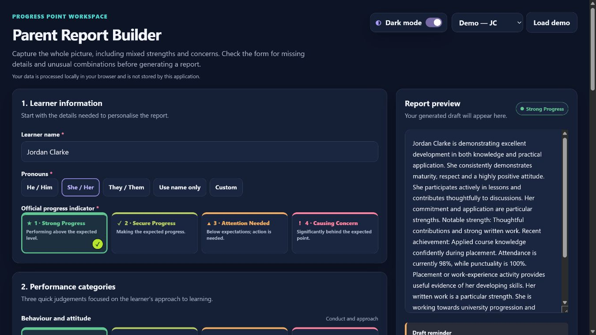
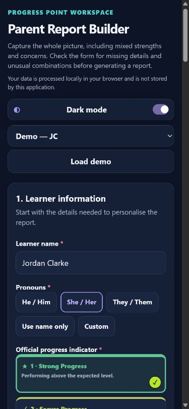

# Progress Tracking Builder

Progress Tracking Builder is a standalone, browser-based tool for lecturers drafting concise, professional progress-point comments for parents. It is designed to work locally, without AI, external APIs, accounts, analytics, or storage of learner information.

> Version 0.4.0 — Phase 4 report editor

## Current status

Phase 4 provides a streamlined 90-second workflow and a complete report editor. Generated drafts can be personalised, copied, restored, cleared, or deterministically regenerated without changing their judgement. Detailed is the default because it most closely reflects the exemplar Progress Point comments.

## Live application

[Open Progress Tracking Builder](https://sean-p-clohessy.github.io/ProgressPointBuilder/)

## Screenshots

### Desktop



### Mobile



## Run locally

Open `index.html` in a modern browser. No installation or build step is required.

If your browser restricts local files, serve the folder with any basic static server, for example:

```text
python -m http.server 8000
```

Then visit `http://localhost:8000`.

## Deploy to GitHub Pages

1. Push this repository to GitHub.
2. Open **Settings → Pages** in the repository.
3. Under **Build and deployment**, choose **Deploy from a branch**.
4. Select the main branch and the root folder, then save.

The project uses relative asset paths and needs no deployment build.

## Privacy

Your data is processed locally in your browser and is not stored by this application. Only the chosen colour theme is saved on the device. Do not add storage, analytics, remote fonts, or network requests that contain learner data.

## Report-generation approach

The report engine builds a learner profile from the official progress indicator, individual category ratings, percentages, and optional structured context. It selects controlled phrases using deterministic rules and a variation index. Ratings are not averaged, and the official progress indicator remains authoritative.

The same inputs and variation index always produce the same draft. No AI or external service is used, and lecturer-entered language is placed into fixed templates rather than interpreted or rewritten.

See `docs/REPORT_LOGIC.md` and `docs/PHRASE_BANK_GUIDE.md`.

## Limitations

- No learner data import, saving, accounts, integrations, or bulk processing is supported.

## Testing

Open `tests/report-engine.test.html` to run the dependency-free report-engine test harness. The current suite contains 20 automated checks. Also review `docs/QA_CHECKLIST.md` and test the page at the listed viewport sizes.
